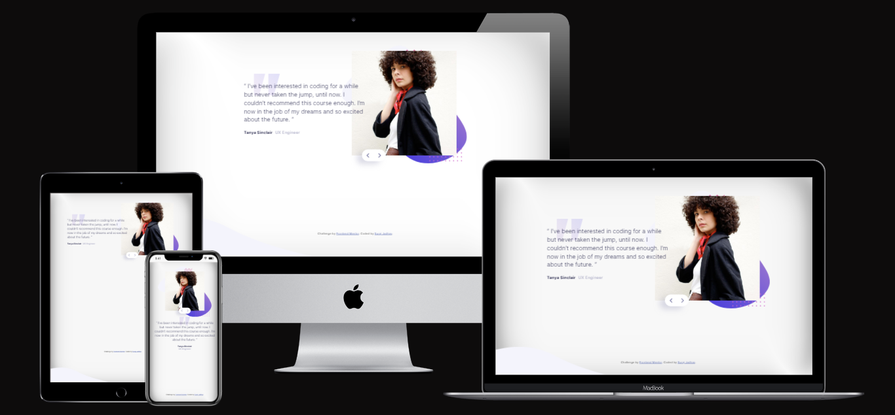

# Frontend Mentor - Coding bootcamp testimonials slider

This is a solution to the [Coding bootcamp testimonials slider challenge on Frontend Mentor](https://www.frontendmentor.io/challenges/coding-bootcamp-testimonials-slider-4FNyLA8JL). 
Frontend Mentor challenges help you improve your coding skills by building realistic projects. 

## Welcome! 👋

Thanks for checking out this front-end coding challenge.

## Table of contents

- [Overview](#overview)
  - [The challenge](#the-challenge)
  - [Screenshot](#screenshot)
  - [Links](#links)
- [My process](#my-process)
  - [Built with](#built-with)

## Overview

### The challenge

- Build out the project to the designs provided

### Screenshot

### Links

- Solution URL: [Github Repo](https://github.com/JadhavSuraj7rk/coding-bootcamp-testimonials-slider)
- Live Site URL: [vercel Site](https://coding-bootcamp-testimonials-slider-nu-pink.vercel.app/)

## My process

I built out the layout for this design using flexbox and found it to be mostly what I was expecting. I have make slider with smooth transistion using plain javascript. 

### Feedback
I would like your Feedback, to correct something that is messy or wrong in my code and to have a different point of view to aggregate in my knowledge. Thank you in advance. 🙏🙏🙏
 

### Built with

- 
- 
- 

